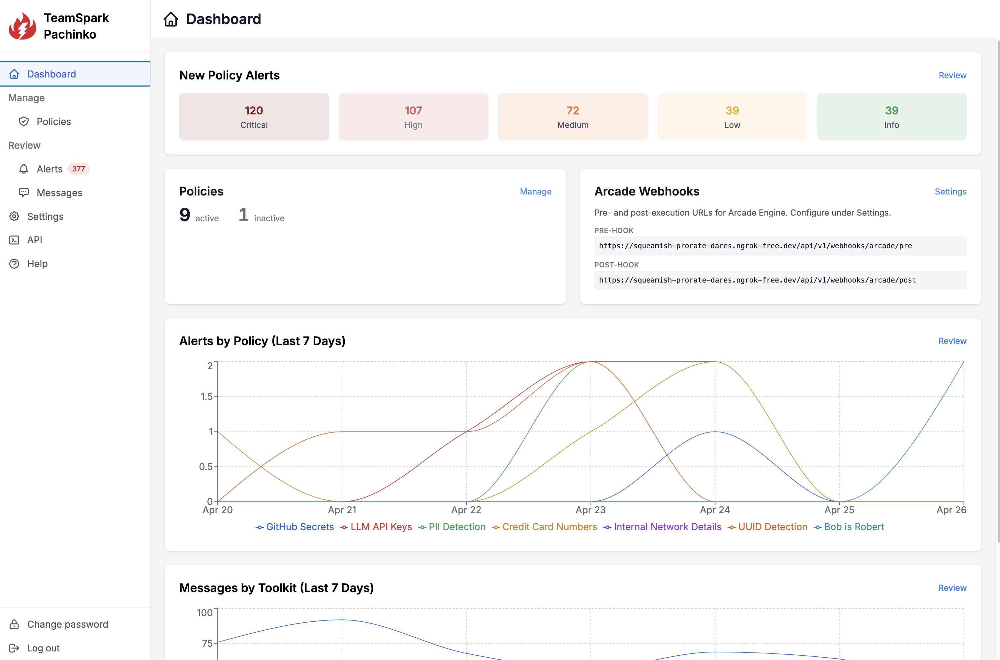

# TeamSpark Pachinko Policy Engine

**An AI tool call policy engine designed for Arcade.dev**

Apply security policies to tool calls happening in Arcade.dev to protect your API tokens, secrets, PII, and more. Pachinko provides webhook entrypoints and bearer token auth making it quick and easy to integrate with Arcade.dev.

Here is a video with an overview, installation walkthrough, and a demo: [Pachinko is a policy engine for Arcade.dev](https://youtu.be/aK7RIkhFyzI)

## Dashboard



## Install and run

**You need Node.js 20 or newer.**

```bash
npm install -g @teamsparkai/pachinko
```

Set a session secret (not required, but strongly advised if exposing to public internet):

```bash
export PACHINKO_SESSION_JWT_SECRET="$(openssl rand -base64 48)"
```

Start the server:

```bash
pachinko --port 3000
```

Open **http://localhost:3000/**. If this is a fresh install, create the admin account; otherwise sign in. 

If this server is not publicly reachable from the Internet, you will need to use a tunnel such as ngrok to make this server's webhooks accessible to Arcade.dev.

```
ngrok http 3000
```

You can then set the provided public host in Pachinko **Settings** and it will show updated webhook callback URLs reachable through that host.

Refer to the product **Help** tab for a step-by-step guide to connect to your Arcade.dev tenant.

---

## Command-line options

| Option | Description |
|--------|-------------|
| **`--port <n>`** | Listen on TCP port `n` (1–65535). |
| **`--log-level <level>`** | One of: `error`, `warn`, `info`, `debug`, `trace`. Overrides **`PACHINKO_LOG_LEVEL`** when both apply. |
| **`--clean`** | Delete the Pachinko **app data directory** (SQLite, logs, `api.json`, etc.) and exit. |
| **`--admin-reset`** | Delete all **`users`** for the **default tenant** and exit. **Stop the server first.** Afterward, **`/login`** offers creating the first admin again. Does not remove API keys or other data. |
| **`--help`**, **`-h`** | Print help and exit. |

If neither **`--port`** nor **`PACHINKO_PORT`** is set, the server uses **port 0** (the OS picks a free port). Read the startup log for the URL.

---

## Environment variables

Set variables in your environment, or use **`.env`** / **`.env.local`**. For **`pachinko`**, values are read from the install directory and then from your **current working directory** (later wins for the same key). **`.env.local`** overrides **`.env`** within each directory.

| Variable | Role |
|----------|------|
| **`PACHINKO_SESSION_JWT_SECRET`** | Signs and verifies the **httpOnly** session cookie (JWT) for the web UI. **Not** a user password or API key. Use a long random value in production. |
| **`PACHINKO_PORT`** | Default HTTP port (1–65535). Ignored if **`--port`** is passed. |
| **`PACHINKO_LOG_LEVEL`** | `error`, `warn`, `info`, `debug`, or `trace`. Default **`info`**. Ignored if **`--log-level`** is passed. |
| **`NODE_ENV`** | Standard Node/Next value (e.g. `production` vs `development`) — affects cookie **`Secure`**, SQLite driver verbosity in development, and similar behavior. |

### Session secret (`PACHINKO_SESSION_JWT_SECRET`)

Generate a value (use either command, then set the output as the variable or paste it after `=` in `.env` — no quotes unless you want them in the secret):

```bash
openssl rand -base64 48
```

```bash
node -e "console.log(require('crypto').randomBytes(48).toString('base64'))"
```

If **`PACHINKO_SESSION_JWT_SECRET`** is unset, the app still starts with a **development default** and logs a **warning or error once per process** (when the **`pachinko`** server starts). Do not rely on that outside quick local use.

---

## Development

### Prerequisites

- **Node.js 20+** and **npm**
- **Git**
- **macOS**, **Windows**, or **Linux** — native modules (**`sqlite3`**, **`argon2`**, **`sharp`**) may require a working build toolchain on your platform (e.g. Xcode CLI tools on macOS, **build-essential** on Debian).

### Clone and install

```bash
git clone https://github.com/TeamSparkAI/pachinko.git
cd pachinko
npm install
```

### Build and run

Full distribution (Next.js production build + bundled `server.ts` → **`dist/`**):

```bash
npm run build
npm run start:prod
```

Same as **`node dist/server.js`** or **`./dist/pachinko`** after a successful build.

**Iterating locally:** **`npm run start:dev`** runs **`build:next`** then **`tsx server.ts -- --port 3000`**.

For **`start:dev`** only, **`.env`** / **`.env.local`** are read from the **repository root** (next to **`server.ts`**), not from cwd.

### npm scripts

| Script | Purpose |
|--------|---------|
| **`npm run build`** | Full **`dist/`** (Next **`.next`**, `pachinko` binary, `appData`, `public`). **Use this (or `prepack`) before publish.** |
| **`npm run build:next`** | **`next build`** (writes **`.next/`** in the repo). |
| **`npm run build:bundle`** | esbuild **`server.ts`** → repo **`dist/server.js`**. |
| **`npm run build:prod`** | **`build:next`** + **`build:bundle`** (what **`scripts/build.js`** runs for the first half). |
| **`npm run start:prod`** | **`node dist/server.js`**. |
| **`npm run start:dev`** | Next build + **`tsx`** server on port **3000**. |
| **`npm run start:server`** | **`./dist/pachinko`** (after **`npm run build`**). |
| **`npm test`** | Jest unit tests. |
| **`npm run test:watch`** / **`npm run test:coverage`** / **`npm run test:e2e`** | Test variants. |
| **`npm run clean`** | Wipe Pachinko app data (same effect as **`pachinko --clean`**; uses **`tsx scripts/clean.ts`**). |
| **`npm run load-sample-data`** | Load optional sample messages (development). |
| **`npm run migrate`** | Standalone migration helper (**`lib/models/sqlite/runMigration.ts`**). |

### Source code and issues

- [github.com/TeamSparkAI/pachinko](https://github.com/TeamSparkAI/pachinko).

## License

This project is licensed under the [MIT License](LICENSE).

